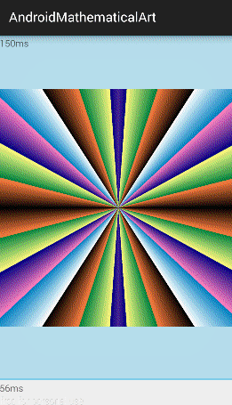

# AndroidMathematicalArt
Use jni to create pictures in http://codegolf.stackexchange.com/questions/35569/tweetable-mathematical-art.

Then show them in Android Imageview, so we can see these pictures on Android phone.

Your can create pictures of yourself by changing just a parameter;

